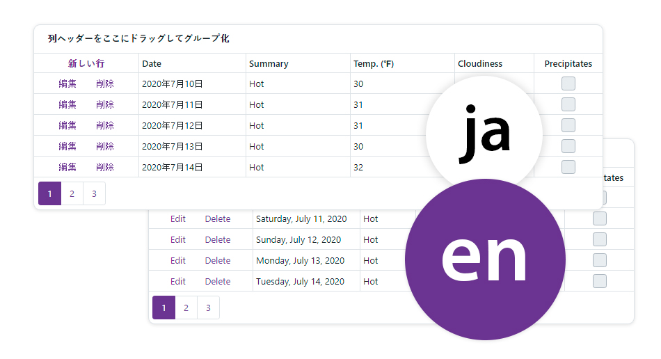

<!-- default badges list -->

<!-- default badges end -->

# DevExpress Blazor - How to localize components
 
DevExpress components in Blazor applications use the standard localization mechanism from the .NET framework - [Satellite Resource Assemblies](https://docs.microsoft.com/en-us/dotnet/framework/resources/creating-satellite-assemblies-for-desktop-apps?view=netframework-4.8).

Our components ship with NuGet packages with predefined satellite assemblies for the following languages and cultures:
  
- German (de)
- Spanish (es)
- Japanese (ja)

To obtain satellite assemblies for DevExpress .NET controls that correspond to other cultures, use the [DevExpress Localization Service](http://localization.devexpress.com/). This service allows you to modify the existing translations, compile and download the satellite assemblies.

<!-- default file list -->
## Files to Look At

Blazor Server:
- [Program.cs](./CS/DxBlazorLocalization/BlazorServer/Program.cs)
- [CultureController.cs](./CS/DxBlazorLocalization/BlazorServer/Controllers/CultureController.cs)
- [Index.razor](./CS/DxBlazorLocalization/BlazorServer/Pages/Index.razor)

Blazor WebAssembly:
- [Program.cs](./CS/DxBlazorLocalization/BlazorWebAssembly/Program.cs)
- [LocalizationService.cs](./CS/DxBlazorLocalization/BlazorWebAssembly/Services/LocalizationService.cs)
- [Index.razor](./CS/DxBlazorLocalization/BlazorWebAssembly/Pages/Index.razor)
<!-- default file list end -->

## Documentation

[Localization](https://docs.devexpress.com/Blazor/401564/common-concepts/localization)

## More Examples

[Theme Switcher](https://github.com/DevExpress-Examples/blazor-theme-switcher)
